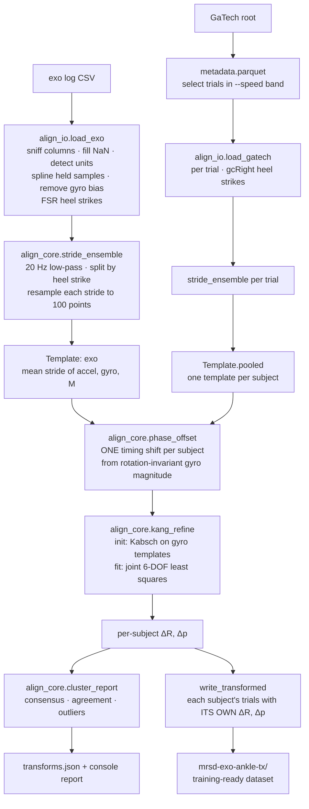

# IMU Cross-Platform Alignment — MRSD Ankle Exoskeleton

Convert the GaTech (Camargo et al. 2021) IMU data into what **our exo's IMUs would
have recorded**, so the control model can be trained on GaTech data and deployed
on our hardware.

> **Status:** validated on synthetic data with known ground truth. One preliminary
> real-data run (10 s, 31 Hz, wrong speed) improved the match for all 22 subjects.
> **Not yet validated on a clean recording.** That is what tomorrow's test is for.

---

## 1. The problem in one paragraph

GaTech's IMUs sit in different places and orientations than ours:

| Segment | GaTech IMU | Our IMU |
|---|---|---|
| Shank | mid/lower shank | lateral, middle of the shin |
| Foot | top of the midfoot | lateral side of the right foot, just below and slightly in front of the ankle |

The same step therefore produces different numbers on their sensors than on ours.
For each segment we estimate the **rotation ΔR** and **offset Δp** between their
sensor and ours, then rewrite every GaTech IMU trace into our sensor frames.

FSRs (binary on/off) and the ankle encoder (constant offset) need no transform and
are **not** handled by this code.

---

## 2. Quick start

```bash
pip install numpy scipy pandas pyarrow matplotlib

# 0. check the exo log is readable and what the columns map to
python3 sniff.py data/data_collection_XXXX.csv

# 1. check the IMU is actually running at its logged rate
python3 plot_log.py data/data_collection_XXXX.csv --seg foot

# 2. fit per-subject transforms and write the transformed dataset
python3 run_alignment.py \
  --gatech-root data/mrsd-exo-ankle \
  --exo-log data/<your_log>.csv \
  --speed 0.85 1.10 \
  --out-root data/mrsd-exo-ankle-tx \
  --report data/transforms.json

#3. To check for differences in waveforms of data
python3 compare_waveforms.py \
  --gatech-root data/mrsd-exo-ankle \
  --tx-root data/mrsd-exo-ankle-tx \
  --exo-log data/<your_log>.csv \
  --transforms data/transforms.json \
  --out-dir data/comparison
```

Add `--mirror` if the exo is on the **left** leg (GaTech IMUs are right-side).
Add `--drop-outliers` to exclude flagged subjects from the transformed dataset.

---

## 3. Files

### Active pipeline

| File | Role |
|---|---|
| `run_alignment.py` | **Main entry point.** Multi-subject: fits one transform per GaTech subject against one exo log, prints the report, writes `transforms.json` and the transformed dataset. |
| `align_core.py` | All the math. No file I/O. Frame helpers, stride templates, phase alignment, Kang-style joint fit, clustering, transform application. |
| `align_io.py` | Loaders. Reads the HF Parquet layout and our exo CSVs into a common `Recording` (SI units, gyro bias removed, heel strikes as sample indices). Handles NaN gaps and held-sample interpolation. |
| `sniff.py` | Auto-maps exo log columns (time, foot/shank accel/gyro/quat, encoder, FSRs). Run standalone to inspect a log. |
| `plot_log.py` | Diagnostic plot: raw vs interpolated gyro, the angular acceleration each produces, power spectrum with true Nyquist. Writes `log_check.png`. |
| `test_multisubject.py` | End-to-end test on a fake 8-subject dataset with known mounts. Run after any code change. |
| `test_alignment.py` | Two-sensor synthetic test of the core transform and lever-arm solver. |

### Earlier / supporting (not needed for the main run)

| File | Role |
|---|---|
| `run_alignment_single.py` | Previous single-subject version using the physics-only estimator (canonical frames + pivot-phase lever arm). Has `--list-columns`. Useful as a cross-check. |
| `virtual_imu.py` | Synthesises IMU signals from rigid-body motion. Used by the tests to generate ground truth. Would also support a motion-capture route if markers are ever added back. |
| `sensor_channels.py` | FSR force synthesis and encoder feature code. **Mostly obsolete** now that FSRs are binary and the encoder is offset-only. |
| `test_virtual_imu.py`, `test_sensor_channels.py` | Tests for the two files above. |

---

## 4. Inputs

### 4.1 GaTech dataset (`--gatech-root`)

Our HF layout (`aicognition/mrsd-exo-ankle`):

```
mrsd-exo-ankle/
  metadata.parquet                         subject, trial, speed_mean_mps, weight_kg, ...
  subjects/<ABxx>/<trial>__imu.parquet     {foot,shank,thigh,trunk}_{Accel,Gyro}_{X,Y,Z}
  subjects/<ABxx>/<trial>__gcRight.parquet HeelStrike (0–100 % cycle, resets at heel strike)
  subjects/<ABxx>/<trial>__id.parquet      ankle_angle_r_moment (training label)
  subjects/<ABxx>/<trial>__fp.parquet      force plate
  subjects/<ABxx>/<trial>__gon.parquet     goniometer
```

| Quantity | Rate | Units used by the code |
|---|---|---|
| IMU accel | 200 Hz | m/s² (auto-detected; measured median ≈ 10.5) |
| IMU gyro | 200 Hz | rad/s |
| Heel strikes | 200 Hz | from `gcRight` wrap-around |

Only trials whose `speed_mean_mps` falls inside `--speed` are used **for fitting**.
Every trial is transformed in the output.

### 4.2 Our exo log (`--exo-log`)

CSV (or Parquet). Column names are detected automatically by `sniff.py`. Our
current format:

```
timestamp_s
foot_ax foot_ay foot_az   foot_gx foot_gy foot_gz   foot_qi foot_qj foot_qk foot_qr
shank_ax ...              shank_gx ...              shank_qi ...
ankle_encoder_deg   heel_fsr_raw   toe_fsr_raw
```

| Quantity | Expected | Notes |
|---|---|---|
| Accel | m/s² | auto-detected from median magnitude (≈ 9.8–10.8) |
| Gyro | rad/s | bias removed from stationary samples |
| Quaternion | i, j, k, real | used by the single-subject estimator for gravity |
| FSRs | raw or binary | heel strikes via Schmitt trigger; binary 0/1 works |
| Rate | 200 Hz logged | **effective** rate is measured; held samples are splined |

Loader behaviour you should know about:
- **NaNs:** gaps shorter than 50 ms are interpolated. Longer gaps are flagged.
- **Held samples:** if the IMU updates slower than the logging rate, a cubic spline
  is fitted through the real update instants. This removes step artefacts but
  cannot recover content above half the true update rate.

---

## 5. Data flow



In words:

1. **Load** the exo log and build its mean stride (accel, gyro, and a helper
   matrix `M` built from angular velocity and acceleration).
2. For **each GaTech subject**: load their speed-matched trials, build their mean stride.
3. **Phase-align** the two mean strides once, using gyro magnitude, which does not
   depend on sensor orientation. The same shift is applied to foot and shank,
   because both are timed by the same heel strikes.
4. **Fit** rotation + offset jointly (Kang et al. 2025 method) so their transformed
   stride matches ours.
5. **Summarise** agreement across subjects and flag outliers.
6. **Write** every trial of every subject, transformed with that subject's own fit.

### The transform

```
gyro_ours  = ΔR · gyro_theirs
accel_ours = ΔR · [ accel_theirs + (skew(α) + skew(ω)²) · Δp ]
```

ω = their gyro, α = its derivative. Gravity is already inside the accelerometer
signal and rotates along with it.

---

## 6. Outputs

### 6.1 Console report

Per subject:
```
AB06 (3 trials)  phase -3.2% (r=0.94)  foot: acc 14.10->4.09 gyr 2.01->1.13  shank: ...
```

Per segment summary:
```
template RMSE, median over subjects
  accel : 14.68 -> 5.83 m/s^2  (+60%)
  gyro  :  2.82 -> 1.99 rad/s  (+29%)
dR agreement: median 10.0 deg from mean, 90th pct 16.8 deg
dp_perp spread: 14 mm   median dp_perp [-67. -1. 18.] mm
phase offset (shared): median -3.0%
OUTLIERS: AB25
```

### 6.2 `transforms.json`

```
{ "foot" | "shank": {
    "R_mean":           3×3 consensus rotation across subjects
    "dp_perp_median":   [x, y, z] m, trustworthy part of the offset
    "angle_median_deg", "angle_p90_deg":  how much subjects disagree on ΔR
    "dp_spread_mm":     how much subjects disagree on Δp
    "outliers":         subject IDs
    "per_subject": { "ABxx": {
        "dR": 3×3, "dp": [x, y, z] m, "shift": % cycle,
        "rmse_before": [accel, gyro], "rmse_after": [accel, gyro],
        "angle_to_mean": deg } } } }
```

### 6.3 Transformed dataset (`--out-root`)

Same layout as the input. Per trial:

- `__imu.parquet` **rewritten**: `time_s`, `{foot,shank}_Accel_{X,Y,Z}` (m/s²),
  `{foot,shank}_Gyro_{X,Y,Z}` (rad/s), now **in our exo's sensor frames**.
  Thigh and trunk columns are **dropped** (we have no such sensors).
- All other streams (`id`, `gcRight`, `fp`, `gon`) **symlinked unchanged**.
- `metadata.parquet` copied.

### 6.4 What the terms mean

| Term | Meaning |
|---|---|
| **ΔR** | Rotation from their sensor axes to ours. "How is our sensor turned relative to theirs?" |
| **Δp** | Offset from their sensor to ours, in metres, in their sensor axes. "How far apart are the sensors?" |
| **dp_perp** | The part of Δp perpendicular to the leg's swing axis. **This is the trustworthy part.** The side-to-side component cannot be measured, but it also does not change what the sensor reads, so it does not matter. |
| **R_mean** | Consensus ΔR across all subjects. For sanity checks; the output uses each subject's own ΔR. |
| **phase shift** | Timing offset between their heel strike (force plate) and ours (FSR). Should be similar across subjects. |
| **r** | Shape similarity of the two mean strides after phase alignment. 1.0 = identical. |

---

## 7. How to read the metrics

| Metric | Good | Investigate | Meaning if bad |
|---|---|---|---|
| Effective ODR | ≈ logged rate | < 0.6 × logged | IMU firmware not keeping up; Δp degraded |
| Exo template strides | ≥ 50 | < 20 | recording too short |
| Phase `r` | > 0.95 | < 0.90 | gait mismatch: speed, cadence, or assistance on |
| Phase shift spread | a few % | varies widely | heel-strike detection unreliable |
| Accel RMSE reduction | ≥ 80 % | < 50 % | Kang benchmark: 83 % |
| Gyro RMSE reduction | ≥ 40 % | < 20 % | Kang benchmark: 41 % |
| Gyro residual | < 1 rad/s | > 1.5 rad/s | gyros don't depend on Δp, so this is **gait mismatch** |
| ΔR agreement (median) | < 7° | > 10° (warns) | fits absorbing gait, not geometry |
| dp_perp spread | < 15 mm | > 25 mm | lever arm unstable |
| `[dp at bound]` | absent | present | offset ran to ±30 cm; unreliable |

**Physical sanity check (do this with a ruler):**

| Segment | Expected `dp_perp` | Preliminary result |
|---|---|---|
| Shank | ~13 cm along the shin, ~0 front-back | [-132, 21, -2] mm ✓ plausible |
| Foot | ~5–8 cm fore-aft, 1–2 cm height | [-67, -1, 18] mm ✓ plausible |

Measure the actual distances on a team member against Camargo's documented IMU
placement. Agreement is our first independent validation.

**Preliminary run for reference** (10 s, 31 Hz, 0.56 m/s, exo powered):
accel −60 % (foot) / −68 % (shank), gyro −29 % / −32 %, ΔR scatter 9–10°.

---

## 8. Recording protocol for tomorrow

The fit is only as good as the match between our recording and GaTech's. Lever-arm
accuracy in particular degrades fast with gait differences (synthetic test:
1.7 mm with identical gait, 14 mm with a small difference, 42 mm with a large one).

1. **Confirm the IMU firmware fix.** `python3 plot_log.py <file>` must report an
   effective ODR close to 200 Hz.
2. **Stand still for 10 s** at the start of every recording.
3. **Treadmill at ~1.0 m/s** (inside the 0.85–1.10 band). Not 2 km/h.
4. **Exo powered OFF / transparent.** Assistance changes the gait.
5. **Match cadence with a metronome.** Get GaTech's cadence at your speed from their
   `gcRight` heel-strike intervals: `cadence (steps/min) = 120 / mean_stride_time_s`.
6. **Walk 3–5 minutes.**
7. **Repeat for 3–4 separate donnings** (take the exo off and put it back on), one
   file each. Run the pipeline on each file.
8. **Name files clearly**, e.g. `calib_poweroff_1p0mps_don1.csv`.

---

## 9. What to do with the output

1. **Go / no-go.** Check the table in §7. If gyro residual is still high and `r` is
   low, the recording conditions didn't match; fix the protocol before going further.
2. **Ruler check** of foot and shank `dp_perp` (§7).
3. **Compare donnings.** Run each donning file. ΔR should barely change between
   donnings; Δp may change a little. The spread is your real donning variability.
4. **Train on the transformed dataset.** Point the existing
   `scripts/prepare.py` / `scripts/train.py` at `mrsd-exo-ankle-tx` instead of
   `mrsd-exo-ankle`. Keep the same subject split. Note that the IMU files now hold
   only foot and shank columns; adjust `prepare.py` if it expects thigh or trunk.
5. **Run the comparison that actually matters.** Train two models, identical except
   for the input data:
   - **A:** original GaTech data
   - **B:** transformed GaTech data

   Test both on our exo recordings. Metric: gait phase RMSE (% of stride) using
   FSR heel strikes as labels, and torque RMSE (N·m/kg) where available.
   Kang et al. reported gait phase error falling from 11.4 % to 2.65 % with their
   transform. **If B clearly beats A, the method is validated.**
6. **Add augmentation (optional, manual for now).** The writer uses point estimates.
   To train over the measured uncertainty, perturb each subject's fit before
   transforming:

   ```python
   import numpy as np, align_core as ac
   rng = np.random.default_rng(0)
   dR_aug = ac.sample_rotation(dR, rng, sd_deg=3.0)
   dp_aug = ac.sample_lever_arm(dp, axis, rng, perp_sd_m=0.008, axis_sd_m=0.025)
   acc2, gyr2 = ac.transform_imu(acc, gyr, fs, dR_aug, dp_aug)
   ```
   Set `sd_deg` and `perp_sd_m` from the donning spread in step 3, not the defaults.

### Important: where the transform is applied

The transform is applied **offline, to the GaTech training data**. The trained model
then lives in **our** sensor frames, so at runtime the exo's IMU stream goes into the
model directly, after the same preprocessing (interpolation, filtering, resampling).
Do **not** transform the live exo stream. (Kang et al. did the opposite direction,
transforming the live stream into the old device's frame; both are valid, but mixing
them is not.)

---

## 10. Troubleshooting

| Symptom | Cause | Fix |
|---|---|---|
| `no usable time column found` | log has no recognisable time column | `--fs 200`, or check with `python3 sniff.py <log>` |
| `could not determine accelerometer units` | magnitude far from 1 g or 9.81 | axes mislabelled or saturating; check the log |
| `only N heel strikes detected` | FSR columns not found or all NaN | `python3 sniff.py <log>` to check mapping |
| `low ODR` warning | IMU updating slower than logged | fix firmware; data is splined meanwhile |
| `no GaTech trials in that speed band` | `--speed` outside 0.86–1.29 m/s | widen the band or walk faster |
| `dR scatter >10 deg` warning | gait mismatch | re-record at matched speed/cadence, exo off |
| `[dp at bound]` | offset unconstrained | usually too few strides or low ODR |
| `Unable to find a usable engine` | no Parquet library | `pip install pyarrow` |
| Transform made things **worse** | sign, unit or left/right error | check units line; try `--mirror` |

---

## 11. Known limitations

- **Synthetic validation only.** Real-data results so far are preliminary.
- **Gait confound.** Every GaTech subject walked without an exo. That bias is the same
  for all 22 subjects, so averaging does not remove it. Tight agreement across
  subjects means the fits are consistent, not that they are unbiased. The powered-off,
  speed- and cadence-matched calibration trial keeps it small.
- **Exo-induced gait change is not fixed by any transform.** People walk differently
  wearing the exo. Closing that gap needs data from our own device (fine-tuning or
  online adaptation from FSR heel strikes, as in Kang et al.).
- **Foot is not one rigid body.** GaTech's sensor is on the midfoot, ours on the
  rearfoot, and ours rides on a shoe/foot plate. Expect a larger foot residual than
  shank.
- **Low ODR** degrades Δp (not ΔR). Interpolation helps but cannot recover content
  above half the true update rate.
- **Speed range.** The HF dataset covers 0.86–1.29 m/s. Slower trials (down to
  0.5 m/s) exist in the original Camargo release if needed.

---

## 12. References

- Kang, Molinaro, Park, Lee, Kunapuli, Herrin, Young. *Online Adaptation Framework
  Enables Personalization of Exoskeleton Assistance During Locomotion in Patients
  Affected by Stroke.* IEEE T-RO 41:4941–4959, 2025. Sec. V: the joint six-parameter
  IMU transform this pipeline's fitting step follows. Corresponding author at CMU MechE.
- Camargo, Ramanathan, Flanagan, Young. *A comprehensive, open-source dataset of lower
  limb biomechanics…* J. Biomech. 119:110320, 2021. Source dataset.
- Scherpereel et al. *Deep domain adaptation eliminates costly data required for
  task-agnostic wearable robotic control.* Science Robotics 10, 2025. Related work,
  same lab and dataset.
