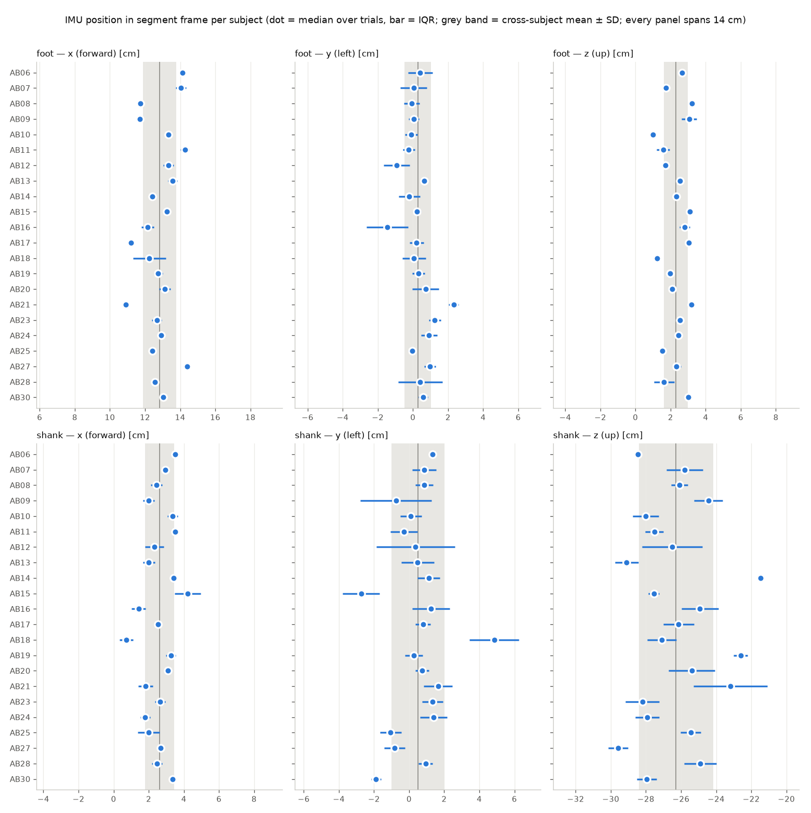

# Foot and shank IMU placement: subject comparison

Subjects: AB06, AB07, AB08, AB09, AB10, AB11, AB12, AB13, AB14, AB15, AB16, AB17, AB18, AB19, AB20, AB21, AB23, AB24, AB25, AB27, AB28, AB30 (Camargo et al. 2021). Each subject's MuJoCo model is converted from their own scaled `.osim`. Positions are medians over the trials that passed the quality gate, in each segment's frame (**x forward, y left, z up**, cm).

## Foot IMU (`calcn_r`, origin = heel (calcaneus origin))

| Subject | Trials kept | Position (x, y, z) cm | Trial spread IQR (x, y, z) cm | Activity range (x, y, z) cm | Orientation spread | Off mean orientation |
|---|---|---|---|---|---|---|
| AB06 | 23/24 | (14.1, 0.4, 2.7) | (0.4, 1.4, 0.3) | (0.3, 2.0, 0.3) | 3.6° | 3.3° |
| AB07 | 20/24 | (14.1, 0.0, 1.7) | (0.6, 1.5, 0.2) | (1.1, 1.8, 0.2) | 3.8° | 4.4° |
| AB08 | 23/24 | (11.7, -0.1, 3.2) | (0.2, 0.9, 0.3) | (0.6, 1.4, 0.5) | 2.6° | 6.7° |
| AB09 | 22/24 | (11.7, 0.1, 3.1) | (0.4, 0.6, 0.9) | (0.4, 0.9, 1.1) | 10.4° | 10.9° |
| AB10 | 16/24 | (13.3, -0.1, 1.0) | (0.4, 0.7, 0.3) | (0.6, 0.7, 0.7) | 4.4° | 9.1° |
| AB11 | 18/24 | (14.3, -0.2, 1.6) | (0.5, 0.7, 0.7) | (1.6, 4.8, 2.1) | 2.3° | 9.7° |
| AB12 | 20/24 | (13.3, -0.9, 1.7) | (0.6, 1.5, 0.3) | (0.8, 1.7, 0.3) | 3.5° | 5.9° |
| AB13 | 23/24 | (13.6, 0.6, 2.5) | (0.5, 0.4, 0.4) | (0.7, 0.5, 0.6) | 3.4° | 1.7° |
| AB14 | 21/24 | (12.4, -0.2, 2.3) | (0.3, 1.2, 0.3) | (0.3, 1.4, 0.5) | 3.2° | 11.5° |
| AB15 | 16/24 | (13.2, 0.2, 3.1) | (0.4, 0.5, 0.3) | (0.5, 0.4, 1.2) | 6.0° | 9.5° |
| AB16 | 23/24 | (12.2, -1.5, 2.8) | (0.7, 2.4, 0.6) | (1.2, 3.2, 1.5) | 2.0° | 12.3° |
| AB17 | 23/24 | (11.2, 0.2, 3.0) | (0.4, 0.8, 0.2) | (0.4, 1.1, 0.2) | 1.7° | 2.6° |
| AB18 | 20/24 | (12.2, 0.1, 1.2) | (1.9, 1.3, 0.4) | (2.7, 1.7, 0.4) | 5.5° | 9.6° |
| AB19 | 18/24 | (12.8, 0.3, 2.0) | (0.5, 0.7, 0.2) | (0.5, 1.9, 0.3) | 3.6° | 6.6° |
| AB20 | 23/24 | (13.1, 0.7, 2.1) | (0.7, 1.5, 0.4) | (1.1, 1.7, 0.9) | 4.7° | 14.5° |
| AB21 | 23/24 | (10.9, 2.3, 3.2) | (0.4, 0.6, 0.4) | (0.4, 0.7, 0.4) | 5.0° | 31.8° |
| AB23 | 23/24 | (12.7, 1.2, 2.5) | (0.6, 0.7, 0.3) | (0.7, 0.8, 0.7) | 4.3° | 6.6° |
| AB24 | 22/24 | (12.9, 0.9, 2.5) | (0.4, 0.9, 0.2) | (0.6, 1.4, 0.3) | 5.5° | 8.1° |
| AB25 | 12/24 | (12.4, -0.1, 1.5) | (0.3, 0.4, 0.3) | (4.0, 1.2, 1.9) | 2.8° | 5.6° |
| AB27 | 22/24 | (14.4, 1.0, 2.3) | (0.3, 0.7, 0.5) | (0.6, 2.1, 0.6) | 2.3° | 7.1° |
| AB28 | 21/24 | (12.6, 0.4, 1.6) | (0.2, 2.5, 1.2) | (0.6, 2.8, 1.4) | 4.7° | 12.8° |
| AB30 | 16/24 | (13.1, 0.6, 3.0) | (0.2, 0.5, 0.3) | (0.7, 0.3, 0.3) | 1.4° | 7.8° |
| **Mean ± SD** | | (12.8 ± 1.0, 0.3 ± 0.8, 2.3 ± 0.7) | | | | |

Normalised by foot length (heel → MTP joint):

| Subject | Foot length cm | x / foot length | z (cm above heel origin) | Sensor x pitch down | Sensor x yaw (medial +) | Face tilt from vertical |
|---|---|---|---|---|---|---|
| AB06 | 18.9 | 0.75 | 2.7 | 38.4° | 2.5° | 41.4° |
| AB07 | 17.7 | 0.79 | 1.7 | 41.7° | 5.8° | 46.4° |
| AB08 | 18.7 | 0.63 | 3.2 | 42.5° | -3.8° | 46.3° |
| AB09 | 16.4 | 0.71 | 3.1 | 31.8° | -1.3° | 33.1° |
| AB10 | 18.3 | 0.73 | 1.0 | 36.5° | -7.4° | 40.6° |
| AB11 | 18.2 | 0.78 | 1.6 | 35.7° | -10.0° | 36.7° |
| AB12 | 17.5 | 0.76 | 1.7 | 43.0° | -5.2° | 44.8° |
| AB13 | 18.2 | 0.75 | 2.5 | 40.1° | 2.5° | 43.7° |
| AB14 | 16.1 | 0.77 | 2.3 | 44.1° | -5.1° | 44.4° |
| AB15 | 19.3 | 0.69 | 3.1 | 35.9° | -10.1° | 37.2° |
| AB16 | 17.6 | 0.69 | 2.8 | 45.1° | 9.4° | 53.9° |
| AB17 | 17.5 | 0.64 | 3.0 | 37.9° | 3.0° | 41.7° |
| AB18 | 17.2 | 0.71 | 1.2 | 43.0° | 9.0° | 51.0° |
| AB19 | 18.7 | 0.68 | 2.0 | 37.0° | -6.5° | 40.0° |
| AB20 | 18.1 | 0.73 | 2.1 | 28.8° | 12.5° | 39.1° |
| AB21 | 16.7 | 0.65 | 3.2 | 36.1° | 9.4° | 36.7° |
| AB23 | 18.9 | 0.67 | 2.5 | 40.0° | 5.4° | 47.1° |
| AB24 | 17.7 | 0.73 | 2.5 | 41.5° | 1.7° | 48.2° |
| AB25 | 16.4 | 0.76 | 1.5 | 36.9° | -2.6° | 41.6° |
| AB27 | 18.8 | 0.77 | 2.3 | 40.0° | 10.1° | 45.8° |
| AB28 | 17.2 | 0.73 | 1.6 | 50.0° | 10.2° | 55.5° |
| AB30 | 18.6 | 0.70 | 3.0 | 36.3° | -5.4° | 40.9° |
| **Mean ± SD** | | 0.72 ± 0.05 | | 39.4° | 0.9° | 43.0° |

## Shank IMU (`tibia_r`, origin = knee joint centre)

| Subject | Trials kept | Position (x, y, z) cm | Trial spread IQR (x, y, z) cm | Activity range (x, y, z) cm | Orientation spread | Off mean orientation |
|---|---|---|---|---|---|---|
| AB06 | 7/24 | (3.5, 1.4, -28.5) | (0.3, 0.3, 0.4) | (0.4, 0.3, 0.4) | 1.2° | 20.2° |
| AB07 | 21/24 | (2.9, 0.9, -25.8) | (0.3, 1.4, 2.1) | (0.3, 2.3, 3.4) | 2.7° | 5.9° |
| AB08 | 21/24 | (2.4, 0.9, -26.1) | (0.6, 1.0, 0.9) | (1.5, 2.1, 1.1) | 2.2° | 11.7° |
| AB09 | 21/24 | (2.0, -0.8, -24.4) | (0.7, 4.0, 1.6) | (0.9, 5.1, 3.0) | 13.5° | 6.6° |
| AB10 | 15/24 | (3.4, 0.1, -28.0) | (0.6, 1.2, 1.5) | (0.9, 1.8, 2.1) | 2.4° | 11.2° |
| AB11 | 16/24 | (3.5, -0.3, -27.5) | (0.4, 1.5, 1.0) | (1.4, 10.0, 6.4) | 2.7° | 6.3° |
| AB12 | 20/24 | (2.3, 0.4, -26.5) | (1.1, 4.5, 3.4) | (1.5, 5.2, 4.3) | 4.2° | 5.2° |
| AB13 | 23/24 | (2.0, 0.5, -29.1) | (0.7, 1.9, 1.3) | (1.2, 2.1, 2.3) | 1.8° | 10.3° |
| AB14 | 21/24 | (3.4, 1.1, -21.5) | (0.2, 1.3, 0.4) | (0.4, 1.3, 0.7) | 1.8° | 12.1° |
| AB15 | 19/24 | (4.2, -2.7, -27.6) | (1.5, 2.1, 0.6) | (2.1, 3.2, 0.8) | 3.6° | 9.4° |
| AB16 | 16/24 | (1.4, 1.2, -24.9) | (0.8, 2.1, 2.1) | (1.2, 2.3, 2.4) | 3.3° | 3.6° |
| AB17 | 23/24 | (2.5, 0.8, -26.1) | (0.3, 0.9, 1.8) | (0.5, 2.2, 2.4) | 2.1° | 8.8° |
| AB18 | 20/24 | (0.7, 4.9, -27.1) | (0.8, 2.8, 1.6) | (1.1, 3.6, 2.0) | 4.6° | 6.3° |
| AB19 | 16/24 | (3.3, 0.3, -22.6) | (0.6, 1.0, 0.8) | (1.4, 1.4, 1.0) | 1.5° | 4.5° |
| AB20 | 24/24 | (3.1, 0.8, -25.4) | (0.4, 0.8, 2.6) | (0.5, 0.9, 3.9) | 2.5° | 12.8° |
| AB21 | 22/24 | (1.8, 1.7, -23.2) | (0.8, 1.6, 4.2) | (1.5, 1.9, 4.6) | 4.1° | 4.5° |
| AB23 | 24/24 | (2.6, 1.3, -28.2) | (0.6, 1.2, 1.9) | (1.1, 1.7, 2.5) | 2.2° | 7.0° |
| AB24 | 22/24 | (1.8, 1.4, -27.9) | (0.6, 1.5, 1.4) | (0.7, 1.6, 1.8) | 2.1° | 9.5° |
| AB25 | 12/24 | (2.0, -1.1, -25.4) | (1.2, 1.2, 1.1) | (1.4, 1.7, 2.4) | 2.2° | 6.9° |
| AB27 | 22/24 | (2.7, -0.8, -29.6) | (0.3, 1.2, 1.1) | (0.4, 1.2, 1.5) | 1.8° | 6.9° |
| AB28 | 20/24 | (2.5, 0.9, -24.9) | (0.6, 0.8, 1.8) | (0.8, 0.8, 2.2) | 2.7° | 6.6° |
| AB30 | 17/24 | (3.4, -1.9, -28.0) | (0.4, 0.6, 1.1) | (0.8, 0.9, 1.3) | 1.8° | 9.3° |
| **Mean ± SD** | | (2.6 ± 0.8, 0.5 ± 1.5, -26.3 ± 2.1) | | | | |

Normalised by tibia length (knee → ankle joint centre):

| Subject | Tibia length cm | Fraction down the shank | x (cm in front of the tibia axis) | Sensor x tilt from shank axis | Face direction (0 = forward, medial +) | Face tilt up |
|---|---|---|---|---|---|---|
| AB06 | 46.5 | 0.61 | 3.5 | 9.9° | 13.5° | 2.6° |
| AB07 | 41.8 | 0.62 | 2.9 | 11.5° | -10.8° | -0.8° |
| AB08 | 44.8 | 0.58 | 2.4 | 4.8° | -17.5° | -0.6° |
| AB09 | 38.9 | 0.63 | 2.0 | 8.7° | -11.6° | 2.5° |
| AB10 | 42.3 | 0.66 | 3.4 | 9.4° | -17.2° | -0.8° |
| AB11 | 43.7 | 0.63 | 3.5 | 8.0° | -0.2° | 0.5° |
| AB12 | 41.5 | 0.64 | 2.3 | 7.9° | -1.5° | -3.3° |
| AB13 | 45.0 | 0.65 | 2.0 | 9.8° | -16.3° | -1.7° |
| AB14 | 38.9 | 0.55 | 3.4 | 8.8° | 5.6° | -3.9° |
| AB15 | 44.0 | 0.63 | 4.2 | 4.1° | -8.6° | -4.0° |
| AB16 | 41.8 | 0.60 | 1.4 | 7.2° | -9.6° | -0.4° |
| AB17 | 43.7 | 0.60 | 2.5 | 7.8° | 2.6° | -0.6° |
| AB18 | 45.8 | 0.59 | 0.7 | 14.3° | -5.6° | -3.5° |
| AB19 | 43.3 | 0.52 | 3.3 | 7.7° | -9.1° | -4.4° |
| AB20 | 46.7 | 0.54 | 3.1 | 13.0° | 5.7° | -3.3° |
| AB21 | 41.8 | 0.56 | 1.8 | 9.2° | -2.0° | -2.5° |
| AB23 | 44.8 | 0.63 | 2.6 | 10.7° | -12.6° | -0.4° |
| AB24 | 44.9 | 0.62 | 1.8 | 9.0° | 3.2° | -0.7° |
| AB25 | 41.7 | 0.61 | 2.0 | 5.7° | -12.7° | -0.8° |
| AB27 | 45.5 | 0.65 | 2.7 | 8.0° | -12.5° | -3.9° |
| AB28 | 41.9 | 0.59 | 2.5 | 11.9° | -9.8° | 3.0° |
| AB30 | 45.1 | 0.62 | 3.4 | 0.8° | -9.2° | 0.1° |
| **Mean ± SD** | | 0.61 ± 0.04 | | 8.1° | -6.2° | -1.3° |

## Data quality

Rejection reasons: **implausible** = gyro matches the mocap far better than a strapped IMU can (likely not a raw recording); **accel** = accelerometer not explained (saturation, damped or corrupt channel); **gyro** = poor gyro fit; **orientation** = fit flipped relative to the subject's other trials.

| Subject | Foot rejected (implausible/accel/gyro/orient.) | Shank rejected (implausible/accel/gyro/orient.) | Thigh accel sign | Clock offset foot / shank |
|---|---|---|---|---|
| AB06 | 1 (0/0/1/0) | 17 (0/16/1/0) | inverted | -7.9 / -13.0 ms |
| AB07 | 4 (0/0/4/0) | 3 (0/0/3/0) | inverted | -9.0 / -14.2 ms |
| AB08 | 1 (0/0/1/0) | 3 (0/0/3/0) | inverted | -11.2 / -16.6 ms |
| AB09 | 2 (0/2/0/0) | 3 (0/3/0/0) | inverted | -7.7 / -12.0 ms |
| AB10 | 8 (0/3/5/0) | 9 (1/5/3/0) | inverted | -10.2 / -15.9 ms |
| AB11 | 6 (5/1/0/0) | 8 (5/1/2/0) | inverted | -10.0 / -12.3 ms |
| AB12 | 4 (1/0/3/0) | 4 (1/0/2/1) | inverted | -10.1 / -12.9 ms |
| AB13 | 1 (0/0/1/0) | 1 (0/0/1/0) | inverted | -9.4 / -15.5 ms |
| AB14 | 3 (0/2/1/0) | 3 (0/2/1/0) | inverted | -8.7 / -13.6 ms |
| AB15 | 8 (3/0/5/0) | 5 (3/1/1/0) | inverted | -11.6 / -12.7 ms |
| AB16 | 1 (0/1/0/0) | 8 (7/1/0/0) | inverted | -6.4 / -13.8 ms |
| AB17 | 1 (0/1/0/0) | 1 (0/1/0/0) | inverted | -8.7 / -13.5 ms |
| AB18 | 4 (0/2/2/0) | 4 (0/2/2/0) | inverted | -9.0 / -13.6 ms |
| AB19 | 6 (0/4/2/0) | 8 (0/7/1/0) | inverted | -10.8 / -17.9 ms |
| AB20 | 1 (0/1/0/0) | 0 (0/0/0/0) | inverted | -8.7 / -14.6 ms |
| AB21 | 1 (0/1/0/0) | 2 (0/2/0/0) | normal | -7.7 / -13.0 ms |
| AB23 | 1 (0/0/1/0) | 0 (0/0/0/0) | inverted | -5.5 / -14.3 ms |
| AB24 | 2 (0/2/0/0) | 2 (0/2/0/0) | inverted | -7.6 / -12.5 ms |
| AB25 | 12 (6/4/2/0) | 12 (6/4/2/0) | normal | -8.0 / -14.0 ms |
| AB27 | 2 (0/1/1/0) | 2 (0/1/1/0) | normal | -7.8 / -13.9 ms |
| AB28 | 3 (0/3/0/0) | 4 (0/4/0/0) | normal | -6.5 / -17.0 ms |
| AB30 | 8 (1/1/6/0) | 7 (1/1/5/0) | normal | -8.2 / -14.6 ms |

Foot and shank accelerometer sign: foot [1], shank [1] across all 22 subjects (+1 = normal, +1 g upward at rest). The thigh accelerometer's sign changes between subjects (column above), so the thigh sensor configuration changed during data collection.
